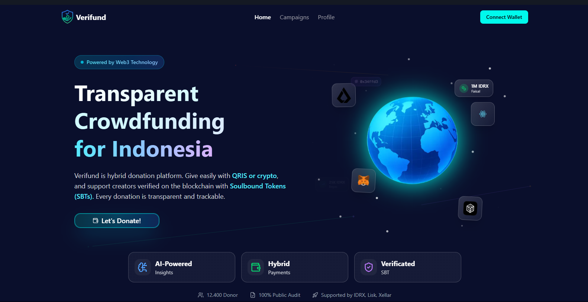

# Verifund Client 🚀

**Transparent Crowdfunding for Indonesia**

Verifund is the first decentralized donation platform that uses blockchain technology to ensure **100% transparency**. Every rupiah is trackable, with no platform fees, powered by IDRX.

🌐 **Live Demo**: [https://verifund.vercel.app/](https://verifund.vercel.app/)



*Screenshot of Verifund's landing page showcasing transparent crowdfunding powered by blockchain technology*

## ✨ Key Features

- **🔒 100% Transparent**: All transactions are recorded on the blockchain
- **💰 Zero Platform Fees**: Donations go directly to campaigners
- **🪙 Powered by IDRX**: Using digital rupiah stablecoin
- **🛡️ Smart Contract Security**: Fund security guaranteed by smart contracts
- **📊 Real-time Tracking**: Monitor fund usage in real-time
- **🎯 Guardian Analysis**: AI-powered analysis for campaign validation
- **🏆 SBT Rewards**: Soul Bound Token for trusted campaigners

## 🛠️ Tech Stack

- **Frontend**: Next.js 15, React 19, TypeScript
- **Styling**: Tailwind CSS 4, Framer Motion
- **Web3**: Wagmi, Viem, Ethers.js
- **Wallet Integration**: @xellar/kit
- **UI Components**: Radix UI, Shadcn/ui
- **State Management**: TanStack Query
- **Form Handling**: React Hook Form + Zod
- **Storage**: IPFS for campaign metadata

## 🚀 Getting Started

### Prerequisites

- Node.js 18.x or newer
- npm, yarn, pnpm, or bun
- Web3 wallet (MetaMask, etc.)

### Installation

1. Clone repository
```bash
git clone <repository-url>
cd verifund-client
```

2. Install dependencies
```bash
npm install
# or
yarn install
# or
pnpm install
# or
bun install
```

3. Setup environment variables
```bash
cp .env.example .env.local
```

4. Run the development server
```bash
npm run dev
# or
yarn dev
# or
pnpm dev
# or
bun dev
```

5. Open [http://localhost:3000](http://localhost:3000) in your browser

## 📁 Project Structure

```
src/
├── app/                    # App Router (Next.js 13+)
│   ├── api/               # API routes
│   ├── campaigns/         # Campaign pages
│   ├── create-campaign/   # Create campaign page
│   └── dashboard/         # Dashboard page
├── components/            # Reusable UI components
│   └── ui/               # Shadcn/ui components
├── features/             # Feature-based modules
│   ├── campaign/         # Campaign related features
│   ├── home/             # Homepage features
│   └── organizer/        # Organizer dashboard features
└── lib/                  # Utilities and configurations
    ├── constants.ts      # App constants
    ├── ethers.ts         # Ethers.js configuration
    ├── web3.ts           # Web3 configuration
    └── utils.ts          # Utility functions
```

## 🔧 Available Scripts

- `npm run dev` - Run the development server
- `npm run build` - Build the application for production
- `npm run start` - Start the production server
- `npm run lint` - Run ESLint
- `npm run check-types` - Type checking with TypeScript

## 🌐 How It Works

### 1. **Create Campaign** 📝
Campaigners create campaigns with detailed information. Data is stored in IPFS for maximum transparency.

### 2. **Donate IDRX** 💸
Donors can use IDRX to make donations, and funds will go directly into a secure smart contract.

### 3. **Full Transparency** 👁️
All transactions are recorded on the blockchain, ensuring complete transparency.

## 🔗 Smart Contract Integration

Deployed on **Lisk Mainnet** for optimal performance and security:

This application integrates with:
- **Campaign Factory Contract**: For creating new campaigns
- **Campaign Contract**: Individual campaign management
- **VerifundSBT Contract**: Soul Bound Token for campaigners
- **IDRX Token**: Digital rupiah stablecoin

### 🌍 Network Information
- **Blockchain**: Lisk Mainnet
- **Chain ID**: 1135
- **Native Token**: ETH
- **Stablecoin**: IDRX
- **Supported Wallets**: MetaMask, WalletConnect, Xellar

## 🤝 Contributing

We welcome contributions from the community! Please:

1. Fork this repository
2. Create a feature branch (`git checkout -b feature/AmazingFeature`)
3. Commit your changes (`git commit -m 'Add some AmazingFeature'`)
4. Push to the branch (`git push origin feature/AmazingFeature`)
5. Create a Pull Request

## 📝 License

This project is licensed under the [MIT License](LICENSE).

## 🆘 Support

If you encounter any issues or have questions:

- Create an [Issue](../../issues) in this repository

---

**Built with ❤️ for a more transparent Indonesia**